# Kubernetes Security Hardening Lab
[](https://github.com/brodyandre/kubernetes-security-hardening-lab/actions/workflows/validate-kubernetes-yaml.yml)
[](LICENSE)

Laboratório prático de segurança em Kubernetes, desenhado para demonstrar capacidade técnica aplicada em ambientes Cloud Native com foco em empregabilidade para funções de DevOps, Engenharia de Dados e Plataforma.

## 1. Visão geral
Este projeto implementa, de ponta a ponta, controles essenciais de segurança para workloads Kubernetes:
- hardening de containers com `SecurityContext`
- identidade de workload com `ServiceAccount`
- autorização com `RBAC` de menor privilégio
- segmentação de rede com `NetworkPolicy`
- bloqueio preventivo com `Pod Security Admission`
- validação contínua de manifests em `GitHub Actions`

Objetivo central: transformar conceitos de segurança em evidências técnicas reproduzíveis localmente.

## 2. Objetivos do projeto
- Executar containers com usuário não-root.
- Aplicar `SecurityContext`.
- Controlar filesystem com `readOnlyRootFilesystem`, `emptyDir` e `fsGroup`.
- Reduzir Linux Capabilities.
- Usar ServiceAccount de forma segura.
- Demonstrar autenticação, autorização e admissão.
- Aplicar RBAC com menor privilégio.
- Demonstrar risco de permissões amplas.
- Usar `imagePullSecrets` para registry privado.
- Aplicar `NetworkPolicy` com restrição por Pod e namespace.
- Validar manifests com GitHub Actions.

## 3. Arquitetura do laboratório
- Mini aplicação `FastAPI` com endpoints para inspeção de contexto de segurança (`/security`) e teste de escrita (`/write-test`).
- Namespace principal `k8s-security-lab` com política `Pod Security Admission: restricted`.
- ServiceAccounts dedicadas por cenário.
- RBAC com perfis de leitura e escopo controlado.
- Cenário de rede segmentada entre `security-frontend`, `security-backend` e `security-observability`.
- Cluster local `kind` com `Calico` para enforcement real de `NetworkPolicy`.
- Scripts de automação para setup, apply, checks, cleanup e publicação no GitHub.

## 4. Tecnologias utilizadas
- Kubernetes
- kubectl
- kind
- Calico
- Docker
- Python
- FastAPI
- RBAC
- NetworkPolicy
- GitHub Actions
- yamllint
- kubeconform
- Trivy

## 5. Estrutura do repositório
```text
kubernetes-security-hardening-lab/
├─ .github/
│  └─ workflows/
│     └─ validate-kubernetes-yaml.yml
├─ app/
│  ├─ main.py
│  ├─ requirements.txt
│  └─ Dockerfile
├─ kind/
│  ├─ cluster-calico.yaml
│  └─ cluster-config.yaml
├─ manifests/
│  ├─ 00-namespaces/
│  ├─ 01-security-context/
│  ├─ 02-service-account/
│  ├─ 03-rbac/
│  ├─ 04-registry-auth/
│  ├─ 05-network-policy/
│  └─ 06-admission/
├─ scripts/
│  ├─ setup.ps1
│  ├─ setup.sh
│  ├─ apply-all.ps1
│  ├─ apply-all.sh
│  ├─ check.ps1
│  ├─ check.sh
│  ├─ cleanup.ps1
│  ├─ cleanup.sh
│  ├─ publish-github.ps1
│  └─ publish-github.sh
├─ docs/
│  ├─ 01-security-context.md
│  ├─ 02-service-account.md
│  ├─ 03-rbac.md
│  ├─ 04-network-policy.md
│  ├─ 05-admission.md
│  ├─ troubleshooting.md
│  └─ evidences/
│     └─ screenshots/
├─ README.md
├─ LICENSE
└─ .gitignore
```

## 6. Como executar no Windows 11
Pré-requisitos: Docker Desktop, kind e kubectl instalados.

```powershell
# 1) Criar cluster Kind com Calico
.\scripts\setup.ps1

# 2) Aplicar laboratório (somente cenários seguros)
.\scripts\apply-all.ps1

# 3) Executar validações técnicas
.\scripts\check.ps1

# 4) Publicar no GitHub (opcional)
.\scripts\publish-github.ps1 -OpenRepoPage
```

## 7. Como executar no WSL2/Linux
Pré-requisitos: Docker, kind e kubectl instalados.

```bash
# 0) (primeira execução) garantir permissão de execução
chmod +x scripts/*.sh

# 1) Criar cluster Kind com Calico
bash scripts/setup.sh

# 2) Aplicar laboratório (somente cenários seguros)
bash scripts/apply-all.sh

# 3) Executar validações técnicas
bash scripts/check.sh

# 4) Publicar no GitHub (opcional)
bash scripts/publish-github.sh
```

## 8. Demonstrações práticas
### Security Context
- Execução não-root (`UID/GID` dedicados).
- Redução de capabilities (`drop: ALL`).
- Root filesystem somente leitura.
- Escrita controlada em `/data` e `/tmp`.

### ServiceAccount
- `app-secure-sa` com `automountServiceAccountToken: false`.
- Separação de identidade por workload.

### RBAC
- Permissões mínimas (`get/list/watch`) para leitura.
- Exemplo de risco com permissões amplas isolado do fluxo padrão.

### NetworkPolicy
- `default deny` no backend.
- Permissão por label de Pod no frontend.
- Permissão por namespace para observabilidade.

### Admission
- Namespace com `restricted`.
- Workload inseguro bloqueado na admissão.

## 9. Evidências esperadas
As evidências abaixo comprovam o comportamento técnico dos controles de segurança implementados.

### 9.1 Índice remissivo
<a id="indice-remissivo"></a>

1. [01 - Estado dos nós (`kubectl get nodes`)](#ev-01)
2. [02 - Estado dos pods (`kubectl get pods -A`)](#ev-02)
3. [03 - RBAC permitido (`can-i list pods`)](#ev-03)
4. [04 - RBAC negado (`can-i delete pods`)](#ev-04)
5. [05 - Security Context (`GET /security`)](#ev-05)
6. [06 - Teste de escrita (`GET /write-test`)](#ev-06)
7. [07 - NetworkPolicy permitido (frontend allowed)](#ev-07)
8. [08 - NetworkPolicy bloqueado (frontend denied)](#ev-08)
9. [09 - NetworkPolicy permitido (observability allowed)](#ev-09)
10. [10 - Admissão bloqueando pod inseguro (`dry-run=server`)](#ev-10)
11. [11 - GitHub Actions workflow aprovado](#ev-11)

### 9.2 Evidências anexadas

<a id="ev-01"></a>
#### 01 - Estado dos nós (`kubectl get nodes`)
Contexto: validação do cluster local e disponibilidade dos nós.

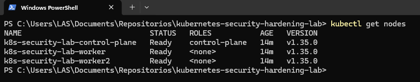

[Voltar ao índice remissivo](#indice-remissivo)

<a id="ev-02"></a>
#### 02 - Estado dos pods (`kubectl get pods -A`)
Contexto: saúde geral do cluster, componentes de sistema e workloads do laboratório.

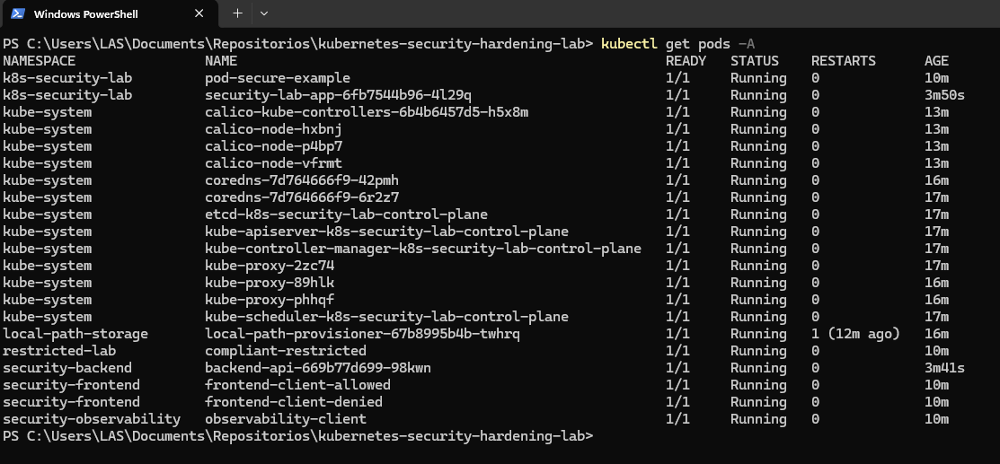

[Voltar ao índice remissivo](#indice-remissivo)

<a id="ev-03"></a>
#### 03 - RBAC permitido (`can-i list pods`)
Contexto: ServiceAccount `pod-reader-sa` com leitura autorizada.

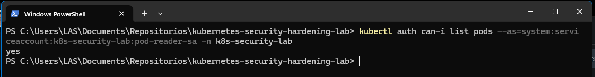

[Voltar ao índice remissivo](#indice-remissivo)

<a id="ev-04"></a>
#### 04 - RBAC negado (`can-i delete pods`)
Contexto: prova do princípio do menor privilégio.

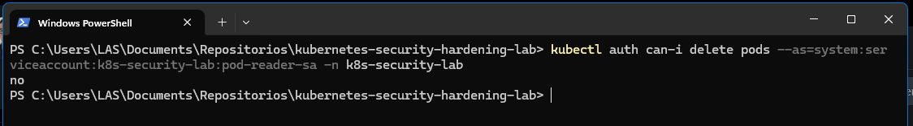

[Voltar ao índice remissivo](#indice-remissivo)

<a id="ev-05"></a>
#### 05 - Security Context (`GET /security`)
Contexto: inspeção de UID, GID, grupos, capabilities, seccomp e token de ServiceAccount.

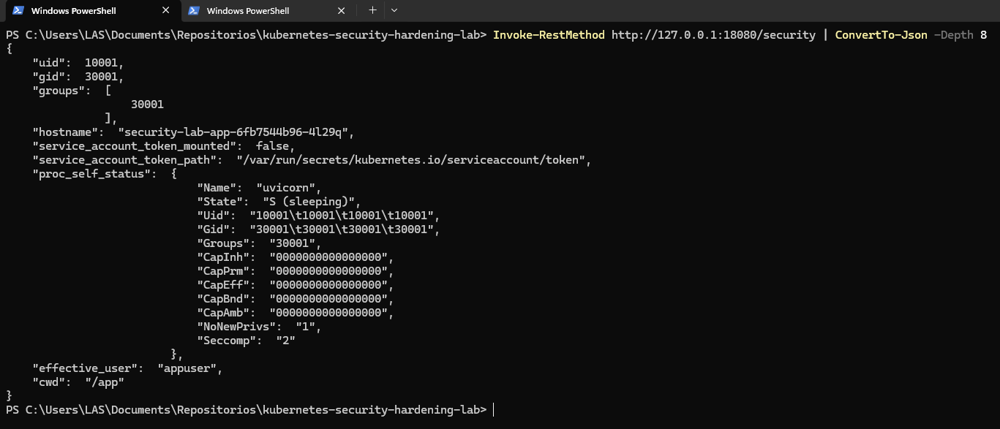

[Voltar ao índice remissivo](#indice-remissivo)

<a id="ev-06"></a>
#### 06 - Teste de escrita (`GET /write-test`)
Contexto: escrita permitida em `/data` e `/tmp`, bloqueio em `/app` por `readOnlyRootFilesystem`.

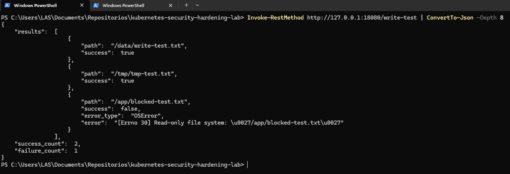

[Voltar ao índice remissivo](#indice-remissivo)

<a id="ev-07"></a>
#### 07 - NetworkPolicy permitido (frontend allowed)
Contexto: pod com label permitida acessa backend com sucesso (`HTTP=200`).

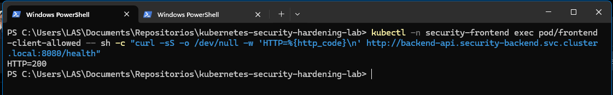

[Voltar ao índice remissivo](#indice-remissivo)

<a id="ev-08"></a>
#### 08 - NetworkPolicy bloqueado (frontend denied)
Contexto: pod sem permissão é bloqueado (timeout/erro de conexão).

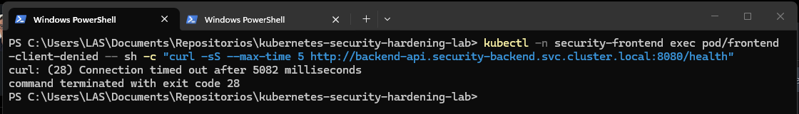

[Voltar ao índice remissivo](#indice-remissivo)

<a id="ev-09"></a>
#### 09 - NetworkPolicy permitido (observability allowed)
Contexto: namespace de observabilidade autorizado a consumir backend.

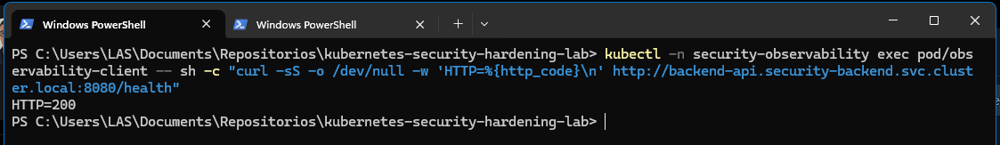

[Voltar ao índice remissivo](#indice-remissivo)

<a id="ev-10"></a>
#### 10 - Admissão bloqueando pod inseguro (`dry-run=server`)
Contexto: `Pod Security Admission` no perfil `restricted` rejeitando manifesto inseguro.

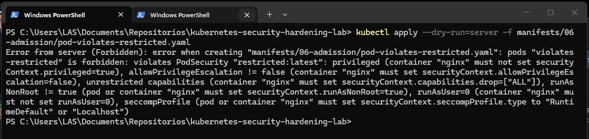

[Voltar ao índice remissivo](#indice-remissivo)

<a id="ev-11"></a>
#### 11 - GitHub Actions workflow aprovado
Contexto: pipeline CI validando qualidade YAML, conformidade de manifests e segurança IaC.

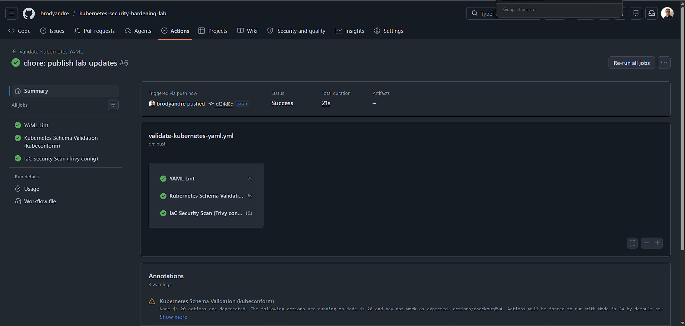

[Voltar ao índice remissivo](#indice-remissivo)

## 10. Boas práticas demonstradas
- Princípio do menor privilégio em RBAC.
- Hardening de containers com `SecurityContext`.
- Isolamento de tráfego com `NetworkPolicy`.
- Identidade de workload com ServiceAccount dedicada.
- Controle preventivo com `Pod Security Admission`.
- CI para lint, schema validation e IaC scan.
- Separação explícita entre cenários seguros e cenários didáticos inseguros.

## 11. Pontos de atenção
- Não usar credenciais reais.
- Não usar `cluster-admin` em produção.
- Não versionar secrets reais.
- `NetworkPolicy` depende de CNI compatível.

## 12. Autor
Luiz André de Souza  
GitHub: [brodyandre](https://github.com/brodyandre)  
LinkedIn: [www.linkedin.com/in/luiz-andre-souza-data-engineer](https://www.linkedin.com/in/luiz-andre-souza-data-engineer)
